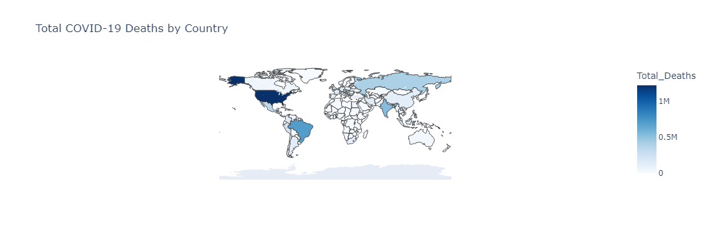
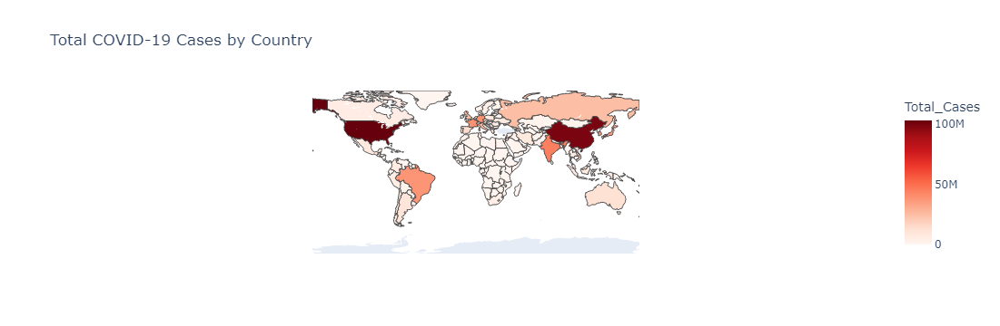

# covid-19-data-analysis
A global COVID-19 data analysis project using WHO data
# COVID-19 Global Data Analysis
This project analyzes COVID-19 case and death trends worldwide using daily data from the World Health Organization (WHO).
## Features
 Cleaned and prepared real-world COVID-19 data from WHO
-  Missing value interpolation and negative value handling
-  Daily trends and time series visualizations
-  Geographic analysis with interactive choropleth maps (Plotly)
-  Country and WHO region comparisons
-  Per capita analysis to normalize by population
-  Hotspot identification by infection rate
## Dataset
Source: /kaggle/input/who-covid-19-global-data
Format:** CSV
Columns used:** `Date_reported`, `Country`, `New_cases`, `Cumulative_cases`, `New_deaths`, `Cumulative_deaths`, `WHO_region`

## Tools Used
- Python 3.x
- Pandas
- NumPy
- Seaborn
- Matplotlib
- Plotly
- Jupyter Notebook

## Visual Highlights

- 📊 Top 10 countries by cumulative cases
- 🌐 Daily case trends by WHO region
- 👥 Country comparison of new cases and per capita rates
- 🗺️ Interactive maps of total cases and deaths
- 📉 Rolling averages and trend smoothing

## 📈 Sample Visualization




📄 [View static notebook output (HTML)](covid19_global_analysis.html)


To run this project locally:

1. Clone the repository:
   ```bash
   git clone https://github.com/George-Jesse/covid19-data-analysis.git
   cd covid19-data-analysis


